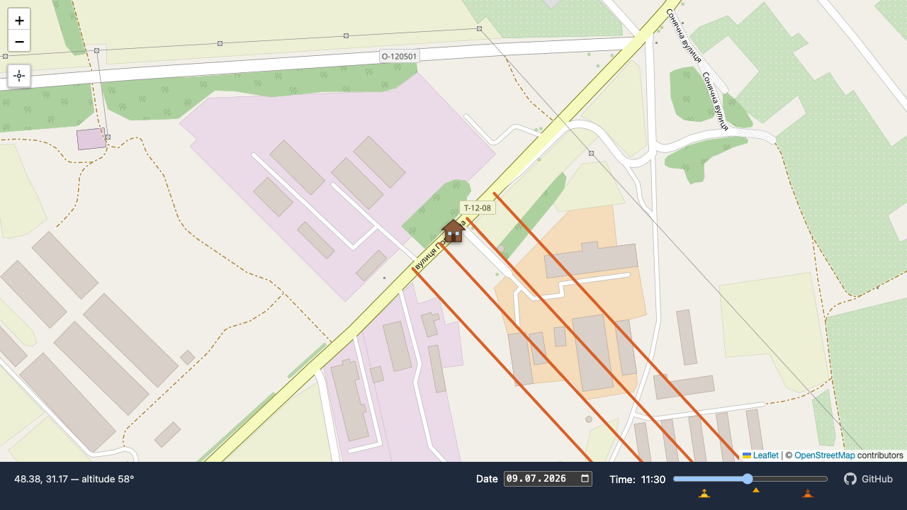
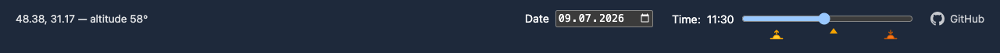

# ☀️ Sunlight Tracker

See where the sun is, right now (or any date/time you pick), for any spot on the map.

🌍 **[Live demo →](https://vbhjckfd.github.io/sunlight-tracker/)**



## ✨ Features

- 🗺️ **Pan-anywhere OSM map** — the 🏠 house marker always sits at the map's center; drag the map to relocate it, and the URL/`localStorage` keep the spot saved for next time.
- 🔆 **Live sunlight beams** — four parallel rays show the sun's direction, colored on a gradient from 🟡 yellow (near the horizon) to 🔴 red (overhead).
- 🌙 **Day/night aware** — beams vanish below the horizon and the status bar flashes "Sun is down" instead.
- 📅🕐 **Date & time picker** — scrub through any day or hour to see how the sun moves.
- 🌅🕛🌇 **Sunrise / solar noon / sunset markers** — clickable icons under the time slider jump straight to that moment.
- 📍 **"Locate me"** button — one click to center the map on your real location (zooms to street level).
- 🌐 **UA / EN interface** — follows your browser's preferred languages, with English as the fallback.
- 🌐 **First-visit geolocation** — no location saved yet? A quick, permission-free IP lookup gets you close, no browser prompt needed.



## 🧰 Tech stack

- [Vite](https://vite.dev/) + TypeScript
- [Leaflet](https://leafletjs.com/) for the map
- [SunCalc](https://github.com/mourner/suncalc) for sun position and rise/set/noon times
- OpenStreetMap tiles

## 🧩 Chrome extension for LUN.ua

The same sun tracking, overlaid on the map of any residential-complex page on
[lun.ua](https://lun.ua) — beams, day playback, and a "sun blocked by a
neighboring building" check while you apartment-hunt. See
[`extension/README.md`](extension/README.md) for screenshots and install steps.


## 🚀 Getting started

This project targets the Node version pinned in [`.nvmrc`](.nvmrc).

```bash
nvm use          # or: make run
npm install
npm run dev
```

Then open the URL Vite prints (usually `http://localhost:5173`).

## 📦 Deploying

Builds and publishes `dist/` to the `gh-pages` branch (served via GitHub Pages):

```bash
make deploy
```

## 🙋 Contact

Found a bug or have an idea? Open an issue or a PR — link's in the app footer, or right here: [github.com/vbhjckfd/sunlight-tracker](https://github.com/vbhjckfd/sunlight-tracker).
