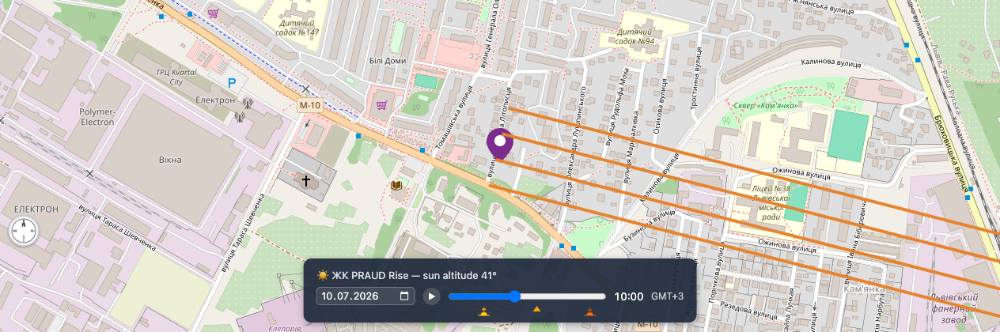
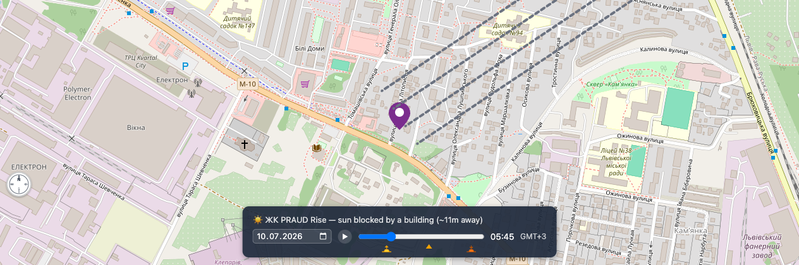
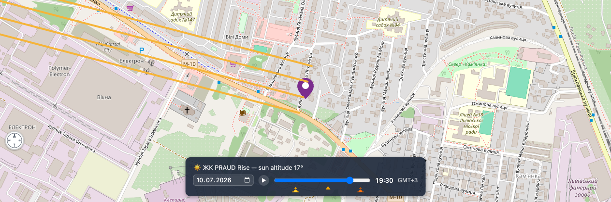

# ☀️ Sunlight Tracker for LUN.ua — Chrome extension

Overlays [Sunlight Tracker](../README.md) functionality on the map of any
residential-complex page on [lun.ua](https://lun.ua) (e.g.
[ЖК PRAUD Rise](https://lun.ua/new/lviv/praud-rise)). Checking where the sun
comes from — and whether a neighboring building steals it — before you pick
an apartment.



## ✨ What it adds to the page

- 🔆 **Sun-direction beams** converging on the complex, colored on a gradient
  from 🟡 yellow (near the horizon) to 🔴 red (overhead)
- 📅🕐 **Date picker + time-of-day slider** with ▶ playback through the day
- 🌅🕛🌇 **Sunrise / solar-noon / sunset markers** under the slider — click to jump
- 🏢 **"Sun blocked by a building" check** (opt-in, BETA) using OpenStreetMap
  building heights (via the Overpass API) — beams turn gray and dashed when a
  neighboring building shades the complex at the selected moment. Off by
  default; enable it with the 🏢 Shadows checkbox in the panel
- 🧭 **Compass rose** that follows the map's rotation
- 🌙 **"Sun is down"** state outside daylight hours

At 05:45 the low morning sun is still hidden behind a neighboring building —
the beams go gray and dashed:



By 19:30 the evening sun reaches the complex from the west, beams near-yellow
at 17° altitude:



## 🧰 How it works

The content script reads the complex's coordinates from the page's JSON-LD
structured data and drapes an SVG + control-bar overlay over the Mapbox GL map
LUN renders into `#map-canvas`. If the complex pin is a DOM marker, the beams
track it through pans and zooms; otherwise they converge on the map center
(where LUN places the complex at load). Map rotation is read off the Mapbox
compass control.

All sun math is shared with the main app
([`src/sunPosition.ts`](../src/sunPosition.ts),
[`src/timezone.ts`](../src/timezone.ts),
[`src/buildingShadows.ts`](../src/buildingShadows.ts)); `tz-lookup` is
replaced at build time with a stub returning `Europe/Kyiv`, since LUN only
lists Ukrainian real estate.

Works on every complex page — plain and language-prefixed URLs alike
(`lun.ua/new/…`, `lun.ua/uk/new/…`, `lun.ua/ru/new/…`). On pages without
complex geo data the script silently does nothing. No extra permissions:
no background worker, no tracking, nothing leaves the page except the
anonymous Overpass API query for building heights.

## 🚀 Build & install

```bash
npm install
npm run build:extension    # or: make extension
# bundles extension/src/content.ts → extension/dist/content.js
```

Then in Chrome:

1. Open `chrome://extensions`
2. Enable **Developer mode** (top right)
3. **Load unpacked** → select the `extension/` folder
4. Open any complex page on lun.ua and scroll to the map ("Розташування")

The picked date/time is remembered in the site's `localStorage`.

## 🏪 Chrome Web Store listing

Ready-made 1280×800 screenshots live in [`store/`](store/). Suggested copy:

> **Short description** (≤132 chars):
> See where the sun comes from — and when neighboring buildings shade it —
> right on LUN.ua residential complex maps.
>
> **Detailed description:**
> Picking an apartment? Sunlight Tracker for LUN.ua overlays live sun
> information on the map of every residential complex page:
>
> • Sun-direction beams for any date and time of year, colored by sun altitude
> • Sunrise, solar noon and sunset markers — one click to jump to that moment
> • Play button to watch the sun sweep across the whole day
> • An opt-in building-shadow check (beta) powered by OpenStreetMap: when a
>   neighboring building blocks the sun at the selected moment, the beams
>   turn gray and the distance to the blocker is shown
>
> No account, no tracking, no permissions beyond the lun.ua pages it runs on.
